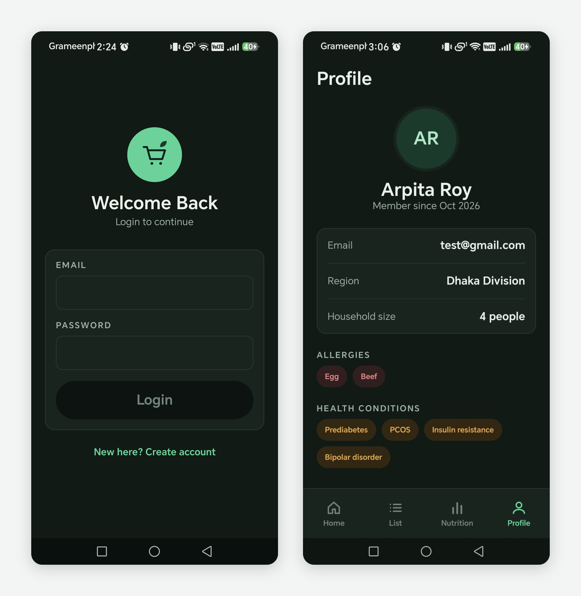
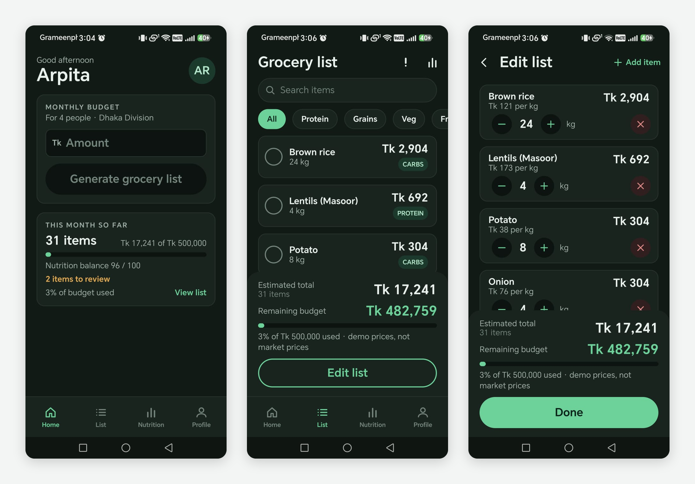
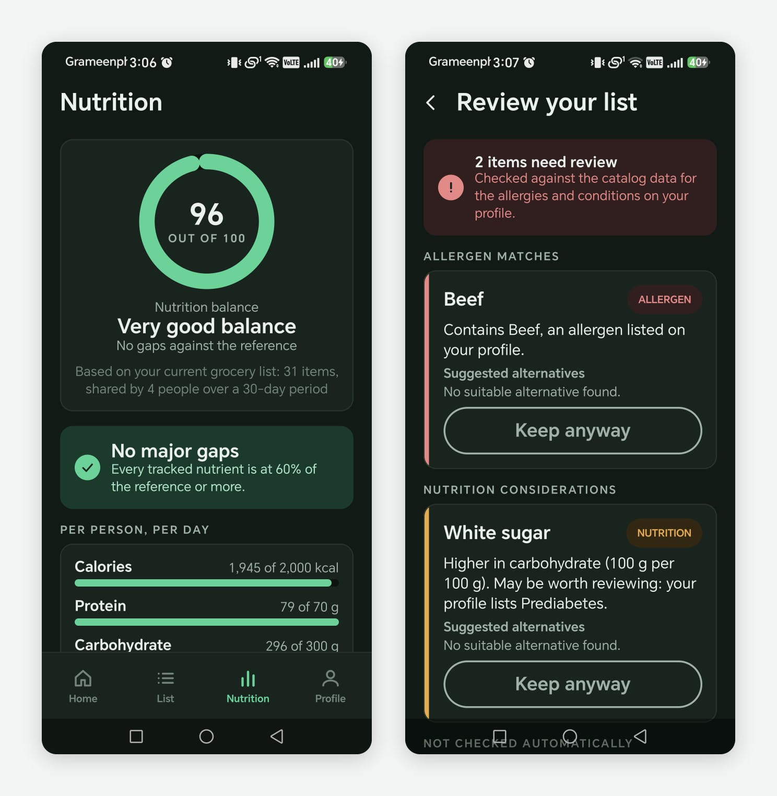

# 🥗 NutriCart

> **A smart, offline-first grocery planning and nutrition companion built with Kotlin and Jetpack Compose.**

NutriCart helps users build personalized grocery lists based on their **household size, budget, region, allergies, and health conditions**, then edit those lists and analyze their nutritional balance.

The application is designed as a **fully local/offline Android app**, with no backend, Firebase, or network dependency.

---

## ✨ Highlights

* 🛒 **Personalized grocery generation**
* 💰 **Budget-aware shopping lists**
* 👨‍👩‍👧‍👦 **Household-size personalization**
* 🌍 **Region-aware pricing**
* ✏️ **Fully editable grocery lists**
* 📊 **Nutrition analysis and scoring**
* ⚠️ **Allergy conflict detection**
* 🩺 **Conservative health-condition analysis**
* 🔄 **Real-time list updates**
* 🔐 **Local account isolation**
* 📱 **Offline-first architecture**
* 🧪 **Comprehensive automated testing**

---

## 📱 What NutriCart Does

NutriCart follows a simple workflow:

```text
Create Account
      ↓
Complete Profile
      ↓
Set Region, Household, Allergies & Health Conditions
      ↓
Set Grocery Budget
      ↓
Generate Personalized Grocery List
      ↓
Edit Quantities / Add / Remove / Mark Items
      ↓
Analyze Nutrition
      ↓
Review Allergy & Health-Condition Conflicts
```

The application keeps grocery data, profile information, authentication data, and analysis state locally on the device.

---

## 🎯 Core Features

### 🛒 Personalized Grocery Generation

NutriCart generates a deterministic grocery basket using:

* Household size
* Grocery budget
* Selected region
* Available catalog items
* Regional prices
* Profile allergies
* Supported health-condition rules

The generator prioritizes essential food coverage before optional variety and never intentionally generates a basket above the selected budget.

---

### ✏️ Grocery List Editing

Generated lists remain completely editable.

Users can:

* Increase or decrease quantities
* Remove items
* Undo removals
* Search the grocery catalog
* Add additional items
* Mark items as bought
* Add duplicate items without creating duplicate rows
* Continue editing even when the list exceeds the budget

Changes are persisted locally.

---

### 📊 Nutrition Analysis

NutriCart analyzes the current grocery list using the actual quantities in the list.

The nutrition engine calculates available values for:

* Calories
* Protein
* Carbohydrates
* Fat
* Iron

Nutrition analysis is based on the available catalog data and household size.

The app provides:

* Overall nutrition score
* Nutrition balance visualization
* Macronutrient information
* Food-group variety
* Largest nutritional gap
* Highlights and observations

> **Important:** NutriCart's nutrition score is a product heuristic for general informational use. It is not a clinical or medical assessment.

---

### ⚠️ Allergy & Health-Condition Intelligence

NutriCart provides conservative rule-based conflict detection.

#### Allergy handling

The system uses explicit catalog allergen metadata rather than guessing from item names.

Supported predefined allergy groups include:

* Milk / Dairy
* Egg
* Fish
* Shellfish
* Chicken / Poultry
* Beef
* Soy
* Peanut
* Tree Nuts
* Wheat / Gluten
* Sesame

Custom allergy entries can also be stored, while automated matching is only performed where documented mappings exist.

#### Health-condition handling

The current rule engine supports condition-specific analysis only where the available nutrition/catalog data provides a reasonable basis.

Examples include:

* Diabetes
* Prediabetes
* Celiac Disease
* Anemia

Other supported profile conditions may be stored but can intentionally show that automated condition-specific analysis is unavailable when sufficient data/rules are not present.

This conservative approach avoids inventing medical recommendations.

> NutriCart is **not a medical diagnosis or treatment application**.

---

## 🔐 Privacy & Offline-First Design

NutriCart does not require:

* Firebase
* A remote backend
* Cloud authentication
* Internet access
* External API calls

Authentication is handled locally.

Passwords are not stored as plaintext. NutriCart uses salted password hashing for local authentication.

User data is isolated by account at the repository/database layer.

---

## 🏗️ Architecture

NutriCart follows a layered architecture designed to keep UI, business logic, and persistence separate.

```text
┌───────────────────────────────┐
│          Jetpack Compose      │
│              UI               │
└───────────────┬───────────────┘
                │
                ▼
┌───────────────────────────────┐
│        ViewModels             │
│   UI State & User Actions     │
└───────────────┬───────────────┘
                │
                ▼
┌───────────────────────────────┐
│       Domain Layer             │
│                               │
│ Grocery Generator             │
│ Nutrition Calculator          │
│ Nutrition Scorer              │
│ Nutrition Insights            │
│ Profile Conflict Rules        │
└───────────────┬───────────────┘
                │
                ▼
┌───────────────────────────────┐
│       Repository Layer        │
└───────────────┬───────────────┘
                │
                ▼
┌───────────────────────────────┐
│       Local Persistence       │
│                               │
│ Room Database                 │
│ DataStore                     │
└───────────────────────────────┘
```

Business logic such as grocery generation and nutrition analysis is kept independent from the Compose UI wherever practical.

This also makes the project easier to test and extend.

---

## 🧠 Rule-Based Intelligence

NutriCart intentionally uses **deterministic, explainable rules** rather than an external AI/LLM service.

For example:

```text
User Profile
     │
     ├── Allergies
     │       ↓
     │   Catalog Allergen Metadata
     │
     └── Health Conditions
             ↓
       Supported Rules
             ↓
       Conflict Analysis
             ↓
       User Review
```

The same documented conflict rules are used during grocery generation and later profile review to keep the two experiences consistent.

When reliable data is unavailable, NutriCart avoids making a condition-specific claim.

---

## 🧰 Technology Stack

| Technology          | Purpose                                     |
| ------------------- | ------------------------------------------- |
| **Kotlin**          | Primary programming language                |
| **Jetpack Compose** | Declarative UI                              |
| **Material 3**      | UI components and design system             |
| **Room**            | Local relational database                   |
| **DataStore**       | Lightweight local preferences/session state |
| **KSP**             | Kotlin code generation                      |
| **Gradle**          | Build system                                |
| **JUnit**           | Unit testing                                |
| **Robolectric**     | JVM Android testing                         |
| **AndroidX Test**   | Android testing infrastructure              |
| **Git / GitHub**    | Version control                             |

### Project Configuration

* Kotlin: `2.2.10`
* Android Gradle Plugin: `9.3.1`
* Gradle: `9.5.0`
* Java: `11`
* Minimum SDK: `24`
* Target SDK: `37`
* Compile SDK: `37`

---

## 📂 Project Structure

```text
NutriCart/
├── app/
│   └── src/
│       ├── main/
│       │   ├── java/com/example/nutricart/
│       │   │   ├── data/
│       │   │   ├── domain/
│       │   │   ├── navigation/
│       │   │   ├── ui/
│       │   │   └── ...
│       │   └── res/
│       │
│       └── test/
│
├── project_docs/
│   ├── implementation_plan.md
│   ├── phase_1_design_system.md
│   ├── phase_2_local_storage.md
│   ├── phase_3_entry_auth.md
│   ├── phase_4_profile_shell.md
│   ├── phase_5_grocery_generation.md
│   ├── phase_6_grocery_editing.md
│   ├── phase_7_nutrition.md
│   └── phase_8_allergy_health.md
│
├── CLAUDE.md
├── README.md
└── ...
```

---

## 🧪 Testing

NutriCart has an automated test suite covering:

* Authentication
* Registration
* Session persistence
* Account isolation
* Profile persistence
* Database migrations
* Grocery generation
* Grocery list editing
* Quantity changes
* Duplicate item handling
* Nutrition calculations
* Nutrition scoring
* Allergy matching
* Health-condition rules
* Conflict consistency
* Navigation
* Empty states

### Latest verification

```text
Tests:        377
Failures:     0
Skipped:      0
Lint errors:  0
```

The project was also manually tested on a physical Android device.

---

## 🚀 Getting Started

### Requirements

* Android Studio
* JDK 11
* Android SDK 37
* Git

### Clone the repository

```bash
git clone https://github.com/arpitaroy2024/NutriCart.git
cd NutriCart
```

### Build

On Windows:

```powershell
.\gradlew.bat assembleDebug
```

### Run tests

```powershell
.\gradlew.bat testDebugUnitTest
```

### Run lint

```powershell
.\gradlew.bat lintDebug
```

You can then open the project in Android Studio and run the `app` configuration on an Android device or emulator.

---

## 📋 Development Phases

NutriCart was developed incrementally to keep functionality, persistence, testing, and documentation aligned.

| Phase   | Focus                                     | Status     |
| ------- | ----------------------------------------- | ---------- |
| Phase 0 | Project foundation & navigation           | ✅ Complete |
| Phase 1 | Design system & reusable components       | ✅ Complete |
| Phase 2 | Local storage & authentication foundation | ✅ Complete |
| Phase 3 | Onboarding & authentication flow          | ✅ Complete |
| Phase 4 | Profile, app shell & user preferences     | ✅ Complete |
| Phase 5 | Grocery generation                        | ✅ Complete |
| Phase 6 | Grocery list editing                      | ✅ Complete |
| Phase 7 | Nutrition analysis                        | ✅ Complete |
| Phase 8 | Allergy & health-condition intelligence   | ✅ Complete |

---

## 🎨 Design Philosophy

NutriCart's UI is built around:

* Clear information hierarchy
* Reusable Compose components
* Consistent spacing and typography
* Accessible interaction patterns
* Simple grocery workflows
* Visual feedback for important states
* Explainable nutrition and conflict information

The project requirements and reference designs guide functionality and flow, while the implementation is allowed to improve usability and visual design rather than reproducing reference screens blindly.

---

## ⚠️ Current Limitations

NutriCart intentionally has some limitations:

* Nutrition analysis depends on the nutrition data available in the local catalog.
* Some health conditions do not currently have enough data for automated condition-specific analysis.
* Custom health conditions do not automatically generate medical rules.
* Custom allergy matching is limited to documented mappings.
* Regional prices are local/demo catalog data rather than live market prices.
* The application does not provide clinical medical advice.
* No cloud synchronization is currently implemented.

These limitations are intentional where reliable data or safe domain rules are not available.

---

## 🔮 Future Possibilities

The current architecture leaves room for future improvements such as:

* Expanded nutrition datasets
* More region-specific catalog data
* Additional validated health-condition rules
* Improved visual design and accessibility
* Cloud synchronization
* More advanced recommendation systems

These are **not required for the current implementation**.

---

## 📚 Documentation

Detailed implementation documentation is available in the [`project_docs`](./project_docs) directory.

The documentation covers:

* Architecture decisions
* Database design
* Authentication
* UI/UX decisions
* Grocery-generation logic
* List-editing behavior
* Nutrition calculations
* Allergy and health-condition rules
* Testing strategy
* Phase-by-phase implementation decisions
---
## 📱 App Screenshots

### 🔐 Authentication & Profile



### 🛒 Grocery Planning



### 📊 Nutrition & Safety


---

## 👩‍💻 Author

**Arpita Roy**

Computer Science & Engineering student and developer focused on building practical software with modern Android technologies.

---

## 📄 License

This project is currently provided for **educational and portfolio purposes**.

Add or replace this section with the project's chosen open-source license if the repository is later released under one.
